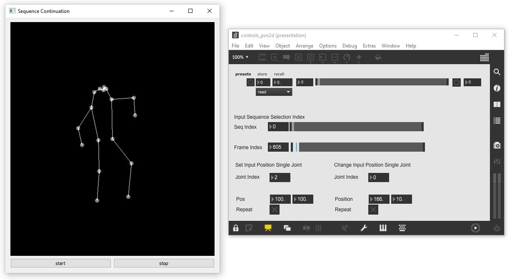

## AI-Toolbox - Motion Continuation - RNN Interactive Pos



Figure 1. Screenshot of the RNN Interactive Pos tool. The window on the left shows the output of the model as simple 2D stick figure. The window on the right is a Max/MSP patch that demonstrates how to send OSC messages to control the RNN Interactive Pos tool. 

### Summary

This Python-based tool can be used to interactively control a machine learning model that has been trained to generate synthetic motion data that represent a continuation of an short motion excerpt. Contrary to the RNN Interactive tool, this tool works with motion data that only specifies joint positions but not rotations. This tool is not able to train a machine learning model. For training, the [RNN tool](../rnn) can be used. The tool can be interactively controlled by sending it OSC messages. The tool also emits OSC messages that contain the synthetically generated motion data.  

### Installation

The software runs within the *premiere* anaconda environment. For this reason, this environment has to be setup beforehand.  Instructions how to setup the *premiere* environment are available as part of the [installation documentation ](https://github.com/bisnad/AIToolbox/tree/main/Installers) in the [AI Toolbox github repository](https://github.com/bisnad/AIToolbox). 

The software can be downloaded by cloning the [MotionContinuation Github repository](https://github.com/bisnad/MotionContinuation). After cloning, the software is located in the MotionContinuation / rnn_interactive_pos directory.

### Directory Structure

- rnn_interactive_pos
  - common (contains python scripts for handling mocap data)
  - controls (contains two example Max/MSP patches for interactively controlling the tool)
  - data 
    - configs (contains configuration files for different skeleton representations used by 2D and 3D Pose Estimation tools)
    - media (contains media used in this Readme)
    - mocap (contains an example mocap recording)
    - results
      - weights (contains example trained model weights)

### Usage

#### Start

The tool can be started either by double clicking the `rnn_interactive_pos.bat` (Windows) or `rnn_interactive_pos.sh` (MacOS) shell scripts or by typing the following commands into the Anaconda terminal:

```
conda activate premiere
cd MocapContinuation/rnn_interactive_pos
python rnn_interactive_pos.py
```

##### Motion Data and Weights Import

During startup, the tool loads one or several mocap capture files and the model weights from a previous training run. By default, the tool loads these files from an example training run whose results are stored in the local data/results folder.  This training run based on 2D Pose Estimation keypoints extracted from a video of a solo improvisation. The model was trained on this data to predict the motion continuation given a short initial motion as input. To load a different training run, the following source code has to be modified in the file `rnn_interactive_pos.py.` 

```
mocap_config_file = "data/configs/COCO_config.json"
mocap_file_path = "data/mocap/"
mocap_files = ["Stocos_Pose2D_BlumenBaile.pkl"]
mocap_sensor_ids = ["/mocap/0/joint/pos_world"]
mocap_root_joint_name = "Left_Hip"
mocap_fps = 30
mocap_joint_dim = 2

rnn_weights_file = "data/results/weights/rnn_weights_epoch_200"
```

The string value assigned to the variable `mocap_config_file`specifies the path to a configuration file that describes the skeleton representation used by the Pose Estimation tool. The string value assigned to the variable `mocap_file_path` specifies the path to the folder that contains motion data files. The list of string values assigned to the variable `mocap_files` specifies the names of the motion data files that will be loaded. The list of string values assigned to the variable `mocap_sensor_ids` specifies the addresses of the OSC messages stored in the motion file that represent  joint positions. The string value assigned to the variable `mocap_root_joint_name` specifies the name of the joint that serves as root joint. The integer value assigned to the variable `mocap_fps` specifies the number of frames per second with which the motion data is stored. The integer value assigned to the variable `mocap_joint_dim`specifies the number of dimensions of the joint positions. This value is 2 for motion data that has been captured with a 2D Pose Estimation tool, and 3 for motion data that has been captured with a 3D Pose Estimation tool. The string value assigned to the variable `rnn_weights_file` specifies the path to the stored weights of a previous training run.

##### Model Settings

The model consists of one or several [Long Short Term Memory](https://www.researchgate.net/publication/13853244_Long_Short-Term_Memory) (LSTM) layers. By default, there are 2 layers and 512 units per layer. Also, by default, the model takes as input a motion sequence that is 64 frames long.  These settings need to be identical to the ones used when training the motion continuation model. To use different model settings and/or a different length for the input motion sequence, the the following source code in the file`rnn_interactive_pos.py` has to be modified:

```
sequence_length = 64
rnn_layer_dim = 512
rnn_layer_count = 2
```

The integer value assigned to the variable `sequence_length` specifies the length of the motion sequence that serves as input to the model. The integer value assigned to the variable `rnn_layer_dim` specifies the number of units per LSTM layer. The integer value assigned to the variable `rnn_layer_count` specifies the number of LSTM layers. 

#### Functionality

At the beginning, the tool passes a short motion sequence from one of the motion capture files that are loaded during startup as input into the motion continuation model. From then on, the model creates synthetic motions in real-time that continue the initial motion sequence. The procedure for creating synthetic motions is as follows: the model takes the current motion sequence as input and predicts a single frame as continuation of the motion sequence, it then removes the first frame from the current motion sequence and appends the predicted frame to the current motion sequence. This procedure continues until the tool is stopped. While running, the behaviour of the tool can be controlled by sending it OSC messages. The tool also outputs the predicted frames as OSC messages. 

### Graphical User Interface

The tool provides a minimal GUI  for starting and stopping the motion continuation and for displaying the generated motions as a simple stick figure (see Figure 1 left side).

### OSC Communication

The tool receives OSC messages that modify its behaviour. Some OSC messages initialise the model with a new input motion sequence. Other OSC messages alter the position of a single joint in the input motion sequence. Initialising the model with a new input motion sequence drastically changes the predicted motion continuation. Altering the position of a single joint only slightly influences the predicted motion continuation. 

The following OSC messages are received by the tool:

- Specifies by index the motion capture file from which a new input motion sequence is extract to initialise the model : `/mocap/seqindex <integer index>`
- Specifies by index the end frame within the current motion capture file which a new input motion sequence is extract to initialise the model : `/mocap/seqinput <integer index>`
- Specifies by index and 2D or 3D position value a joint whose position is overwritten in the input motion sequence : /mocap/setjointpos`<integer index>  <float posx> <float posy> (<float posz>)`
- Specifies by index and 2D or 3D position value a joint to which a position is added in the input motion sequence : /mocap/changejointpos`<integer index>  <float posx> <float posy> (<float posz>)`

By default, the tool receives OSC messages from any IP address and on port 9002. To change the IP address and/or port, the following code in the file `rnn_interactive_pos.py` has to be changed:

```
osc_receive_ip = "0.0.0.0"
osc_receive_port = 9002
```

The string value assigned to the variable  `osc_receive_ip` specifies the IP address of the computer from which the tool receives OSC messages. "0.0.0.0" represents any IP address. The integer value assigned to the variable `osc_receive_port` specifies the port on which the tool receives OSC messages.


The software sends the following OSC messages representing the joint positions of the currently predicted motion frame.
Each message contains all the joint positions and rotations grouped together. In the OSC messages described below, N represents the number of joints.

The following OSC messages are sent by the software:

- joint positions as list of 2D or 3D vectors in world coordinates: `/mocap/0/joint/pos_world <float j1x> <float j1y> (<float j1z>) .... <float jNx> <float jNy> (<float jNz>)` 

By default, the tool sends OSC messages to IP address "127.0.0.1" and to port 9004. To change the IP address and/or port, the following code in the file `rnn_interactive_pos.py` has to be changed:

```
osc_send_ip = "127.0.0.1"
osc_send_port = 9004
```

The string value assigned to the variable  `osc_send_ip` specifies the IP address of the computer to which the tool sends OSC messages. "127.0.0.1" represents the same computer on which the tool is running. The integer value assigned to the variable `osc_send_port` specifies the port to which the tool sends OSC messages.

### Limitations and Bugs

- The tool only generates synthetic motions for a single person.


